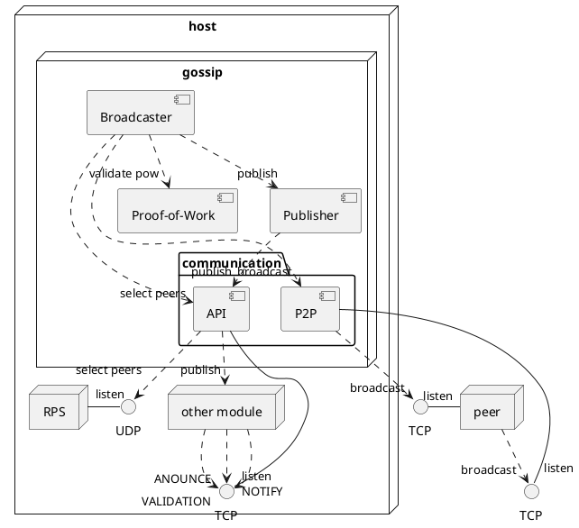
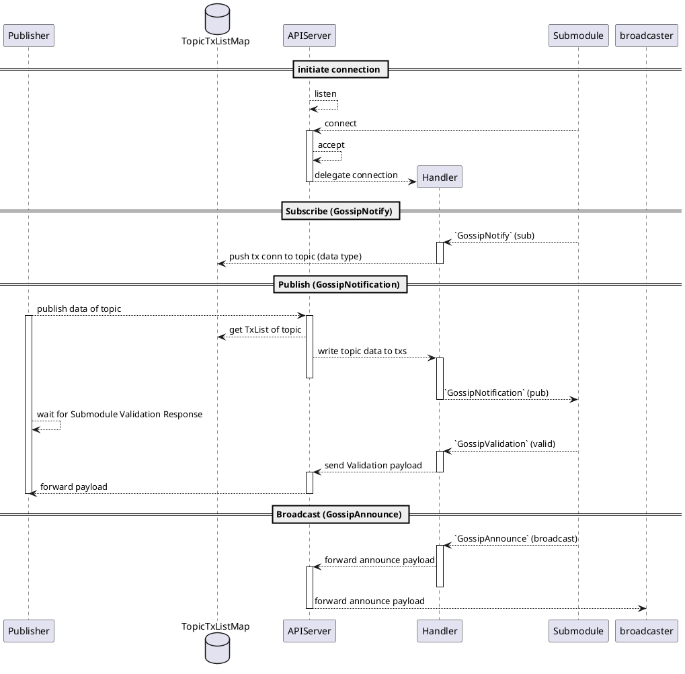

# Gossip-Module Architecture

## Component Diagram

```plantuml
@startuml

' other peer
() "TCP" as i_peer
node "peer" as peer
i_peer - "listen" peer

' host peer
() "TCP" as i_p2p
node "host" as host {
    node "other module" as other_mod
    
    () "UDP" as i_rps
    node "RPS" as rps
    rps - "listen" i_rps
    
    () "TCP" as i_api
    node "gossip" {
        package "communication" {
            [P2P] as p2p
            [API] as api
            
            
            p2p - "listen" i_p2p
            api - "listen" i_api
        }

        [Proof-of-Work] as pow
        [Publisher] as pub
        [Broadcaster] as broadc
        
        ' internal gossip comms
        broadc ..>  "validate pow" pow
        ' NOTE pub returns error if valid fails
        broadc ..> "publish" pub
        
        ' external gossip module comms
        pub ..> "publish" api
        api ..> "publish" other_mod
        
        broadc ..> "select peers" api
        api ..> "select peers" i_rps
        
        
        ' external peer comms
        broadc ..> "broadcast" p2p
        p2p ..> "broadcast" i_peer
    }
    
    ' other mod messages to gossip
    other_mod ..> "ANOUNCE" i_api
    other_mod ..> "NOTIFY" i_api
    other_mod ..> "VALIDATION" i_api
}

' peer to host comms
peer ..> "broadcast" i_p2p

@enduml
```

## Communication

### API-Comm

#### Communication Flow

```plantuml
@startuml
' participants
'' datatype : [Conn]
participant Publisher as pub
database TopicTxListMap as kv
participant APIServer as api
participant Handler as handler
participant Submodule as sub

' interactions (chronological)
== initiate connection ==
api --> api: listen
sub --> api: connect
activate api
api --> api: accept
api --> handler **: delegate connection
deactivate api

== Subscribe (GossipNotify) ==
sub --> handler: `GossipNotify` (sub)
activate handler
handler --> kv: push tx conn to topic (data type)
deactivate handler

== Publish (GossipNotification) ==
pub --> api: publish data of topic
activate pub
activate api
api --> kv: get TxList of topic
api --> handler: write topic data to txs
activate handler
deactivate api
handler --> sub: `GossipNotification` (pub)
deactivate handler
pub --> pub: wait for Submodule Validation Response
sub --> handler: `GossipValidation` (valid)
activate handler
handler --> api: send Validation payload
deactivate handler
activate api
api --> pub: forward payload
deactivate api
deactivate pub

== Broadcast (GossipAnnounce) ==
sub --> handler: `GossipAnnounce` (broadcast)
activate handler
handler --> api: forward announce payload
activate api
deactivate handler
api --> broadcaster: forward announce payload
deactivate api

@enduml
```