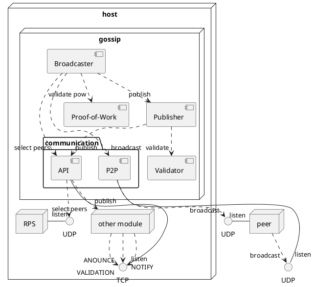

# Gossip-Module Architecture

## Component Diagram

```plantuml
@startuml

' other peer
() "UDP" as i_peer
node "peer" as peer
i_peer - "listen" peer

' host peer
() "UDP" as i_p2p
node "host" as host {
    node "other module" as other_mod
    
    () "UDP" as i_rps
    node "RPS" as rps
    rps - "listen" i_rps
    
    () "TCP" as i_api
    node "gossip" {
        package "communication" {
            [P2P] as p2p
            [API] as api
            
            
            p2p - "listen" i_p2p
            api - "listen" i_api
        }

        [Proof-of-Work] as pow
        [Validator] as valid
        [Publisher] as pub
        [Broadcaster] as broadc
        
        ' internal gossip comms
        broadc ..>  "validate pow" pow
        ' NOTE pub returns error if valid fails
        broadc ..> "publish" pub
        pub ..> "validate" valid
        
        ' external gossip module comms
        pub ..> "publish" api
        api ..> "publish" other_mod
        
        broadc ..> "select peers" api
        api ..> "select peers" i_rps
        
        
        ' external peer comms
        broadc ..> "broadcast" p2p
        p2p ..> "broadcast" i_peer
    }
    
    ' other mod messages to gossip
    other_mod ..> "ANOUNCE" i_api
    other_mod ..> "NOTIFY" i_api
    other_mod ..> "VALIDATION" i_api
}

' peer to host comms
peer ..> "broadcast" i_p2p

@enduml
```